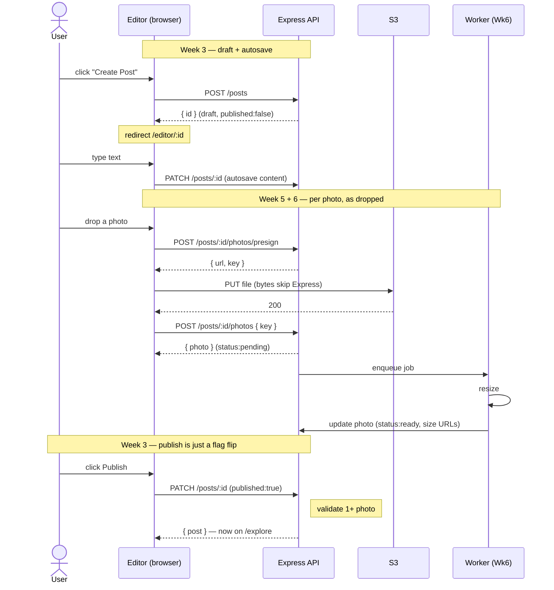
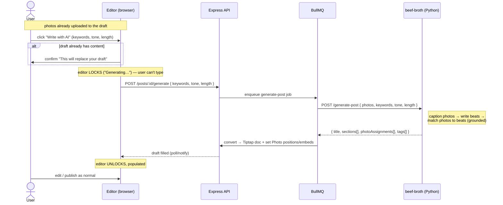

# Editor Dataflow — draft → upload → publish

How a post and its photos get created. The key idea: **the post row is created the
moment the editor opens (an empty draft), before the user writes anything** — so every
photo always has a `postId` to attach to (`Photo.postId` is required).

Built across three weeks:
- **Week 3** — draft create (`POST /posts`) + autosave (`PATCH /posts/:id`)
- **Week 5** — presigned S3 upload + photo registration
- **Week 6** — background worker (resize)

## Three things to remember

1. **The post row is born first.** Everything else hangs off its `id`. There's never a
   moment with photos-in-hand but no post.
2. **File bytes bypass Express.** The browser `PUT`s straight to S3 via a presigned URL.
   Express only ever handles small JSON (the presign request and the key registration).
3. **Publish is trivial** — one boolean. All the real data (content + photos) was
   persisted incrementally during editing, so drafts "just work."

## Who does what

- **Client (editor)** orchestrates: presign → upload → register the key. It *attaches*
  photos to the post, one at a time, as each finishes uploading.
- **Worker** only *processes* the image (resize). It does **not** attach photos to
  posts. Easy to conflate — keep them separate.
- (A browser **Service Worker** is an unrelated thing — a client-side network proxy. The
  background image processor here is just a server-side queue consumer.)

---

## "Write with AI" — the AI-seeded draft (post generation)

The AI post-generation feature is **not a second editor**. There is one editor and one
canonical format (Tiptap JSON + `Photo` rows). "Write with AI" just *pre-fills* it. The
AI work runs in **beef-broth** (Pholio's Python AI service); Pholio triggers it and applies
the result.

Precondition: **photos are uploaded first** (the flow above). Then the button writes.

### Things to remember

1. **One editor, two doors.** Manual typing and AI generation both produce the same
   `content` (Tiptap JSON) + `Photo` rows. The AI draft is just a pre-filled manual draft.
2. **Confirm up front, lock during.** The overwrite confirm fires *before* generation; the
   editor is locked *during* it. So nothing the user types can be clobbered mid-run.
3. **Async + walk-away.** The job runs on BullMQ (20-30s). If the user closes the tab, the
   job still finishes and they return to a filled draft.
4. **Grounded only.** beef-broth writes from keywords + photo captions, never invents. If
   keywords are thin it writes shorter rather than padding.
5. **Photo placement.** `photoAssignments` pair each photo to the beat it illustrates
   (embedding similarity: `beat_summary` vs caption). Pholio turns those into `PhotoEmbed`
   nodes placed after each beat. See beef-broth `design/overview.md`.
